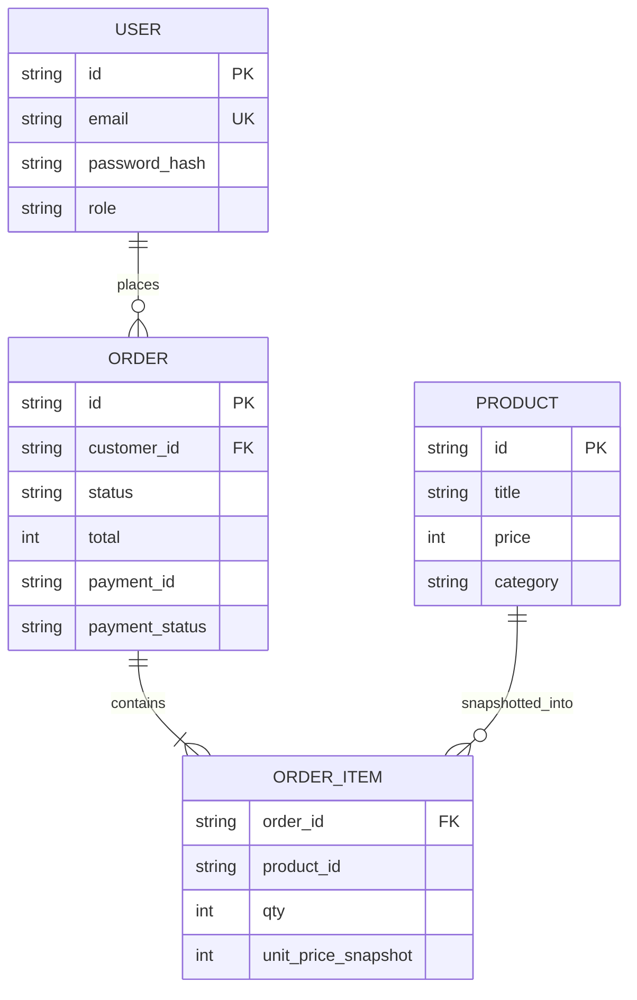

# FIGURES. architecture (basic)

```
[Browser React SPA]
   hooks + CartContext + AuthContext
   fetch /api/v1  (JWT, Idempotency-Key)
        |
[Vite / Express modular monolith]
   /products (in-memory cache)
   /auth/login (JWT)
   /orders (state machine + snapshots)
   /assistant (Groq or catalog fallback)
        |
[In-process store]  →  later: Postgres + Redis + LB
```

At multiple instances: stateless API, JWT, Redis cache. No sticky sessions.

## ERD (target schema; demo uses in-memory maps)



`unit_price_snapshot` is the historical price. It is not a live FK to `PRODUCT.price`.
